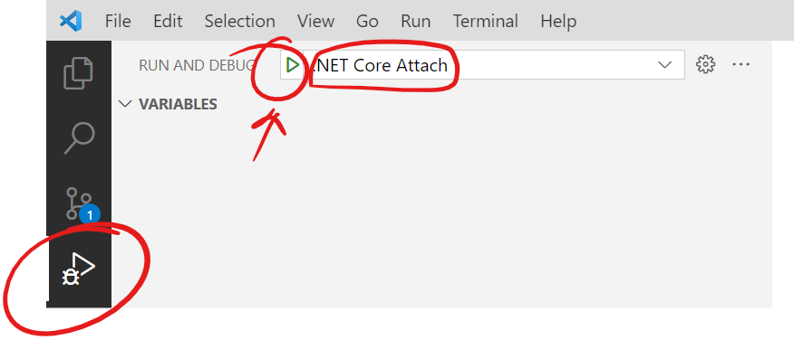
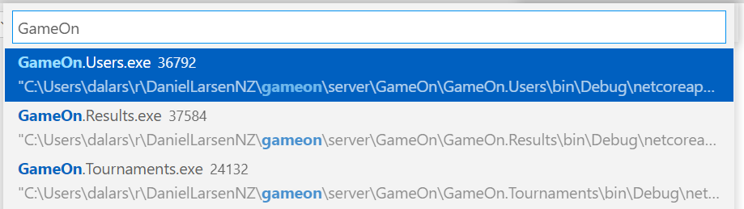

# Game On! Server

## Getting started

For local backend dev you will need:

1. VS Code
2. Git CLI
3. .NET Core 3.1
4. [Docker Desktop](https://www.docker.com/products/docker-desktop)
5. [Dapr CLI](https://docs.dapr.io/getting-started/install-dapr-cli/)
6. [DAPR VS Code Extension](https://github.com/microsoft/vscode-dapr)

Then run these commands in a terminal:

```powershell
# Clone
git clone https://github.com/DanielLarsenNZ/gameon.git
cd gameon

# Init Dapr local *Must run as Admin / sudo
dapr init
```

## Run local

A helper script to run all services locally is provided. Dapr must be initialised and running in Docker (Docker desktop).

```powershell
cd /deploy
./run-dapr-local.ps1
```

## Debug local

Once you have run `run-dapr-local.ps1`, and each service is running in its own console, you can easily debug attaching the VS Code debugger.

1. In VS Code, click the **Run and Debug** button
2. Choose **.NET Core Attach** from the dropdown
3. Click the play button



VS Code will prompt to select the process to attach to. 

4. Type "GameOn" into the search box
5. Choose the `GameOn.*.exe` process that you wish to debug



You can debug mutiple processes at one. Repeat these steps for each process.

## Clearing local storage and messages

By default the local dev environment uses a local Redis instance for storage and messaging. You can purge the entire Redis DB using `redis-cli`.

First install `redis-cli` on Ubuntu in WSL2:

    sudo apt-get update
    sudo apt-get install redis-tools

Next list and then purge the keys

    # Start redis-cli
    $ redis-cli
    
    # List all of the keys in the DB
    127.0.0.1:6379> KEYS *

    # Delete all of the keys and values in the current DB
    127.0.0.1:6379> FLUSHDB

    # Verify that the keys have been deleted
    127.0.0.1:6379> KEYS *

## Creating a new Service

Each service is a new Visual Studio ASP.NET Core project. It is easiest to create new services in Visual Studio (Community, Developer or Enterprise).

1. Add a new ASP.NET Core API Project, e.g. `GameOn.(NewServiceName)`
2. Add project references to `GameOn.Common`, `GameOn.CommonCore`

Use another service project as a template and:

1. Copy nuget references
2. Clone Startup.cs
3. Create a new empty API Controller
4. Create new Models in `GameOn.Common` project, in the Models folder, but change namespace back to `GameOn.Common`
5. Implement a Service

Before you run locally you will need to:

1. Add new lines to `/deploy/run-dapr-local.ps1` to build and run the Service. Choose a new unused port for the new service.
2. Update `Properties/launchSettings.json` to only startup on HTTP and to use the port you chose in the previous step. See [How to change the port number for Asp.Net core app?]

## Links & references

👉🏻 <https://docs.microsoft.com/en-us/graph/tutorials/aspnet-core?tutorial-step=3>

[GitHub Actions Default environment variables](https://docs.github.com/en/free-pro-team@latest/actions/reference/environment-variables#default-environment-variables)

[Debugging Dapr applications with Visual Studio Code](https://blog.ehn.nu/2020/03/debugging-dapr-applications-with-visual-studio-code/)

[ASP.NET Core Middleware order](https://docs.microsoft.com/en-us/aspnet/core/fundamentals/middleware/?view=aspnetcore-3.1)

[ASP.NET Core Routing Sample](https://github.com/dapr/dotnet-sdk/tree/master/samples/AspNetCore/RoutingSample) - for inter-service calls

[How to review your Azure AD B2C tokens using Policy – Run Now and jwt.ms](https://saraford.net/2017/09/18/how-to-review-your-azure-ad-b2c-tokens-using-policy-run-now-and-jwt-ms/)

[Quickstart: Protect an ASP.NET Core web API with Microsoft identity platform](https://docs.microsoft.com/en-us/azure/active-directory/develop/quickstart-v2-aspnet-core-web-api)

[Azure-Samples/active-directory-dotnet-native-aspnetcore-v2](https://github.com/Azure-Samples/active-directory-dotnet-native-aspnetcore-v2)

[Microsoft identity platform and OAuth 2.0 authorization code flow](https://docs.microsoft.com/en-us/azure/active-directory/develop/v2-oauth2-auth-code-flow#request-an-access-token)

[How to change the port number for Asp.Net core app?]

<!-- link refs -->
[How to change the port number for Asp.Net core app?]:https://stackoverflow.com/a/49795443/610731
